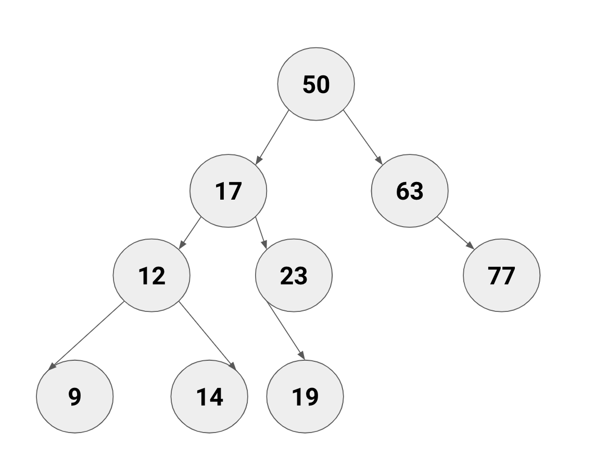
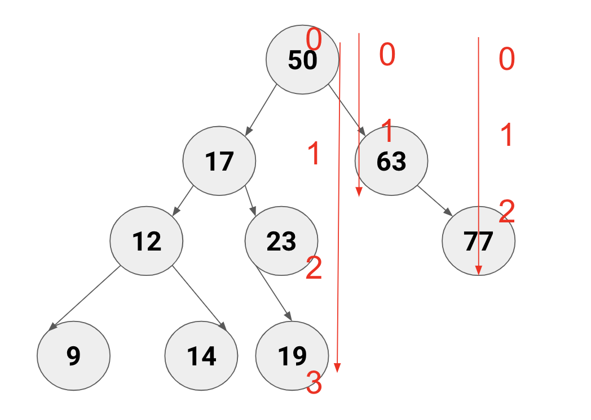
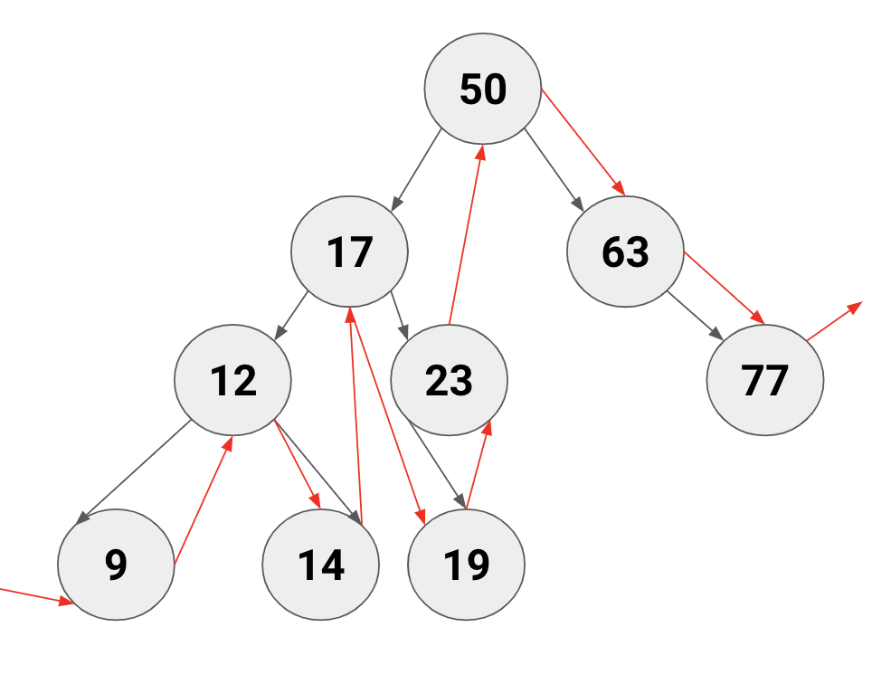
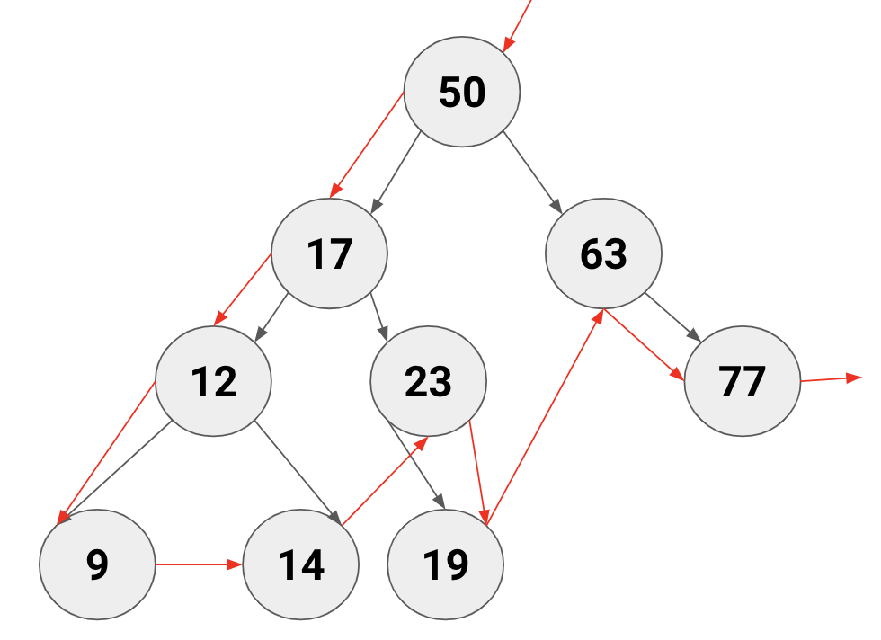
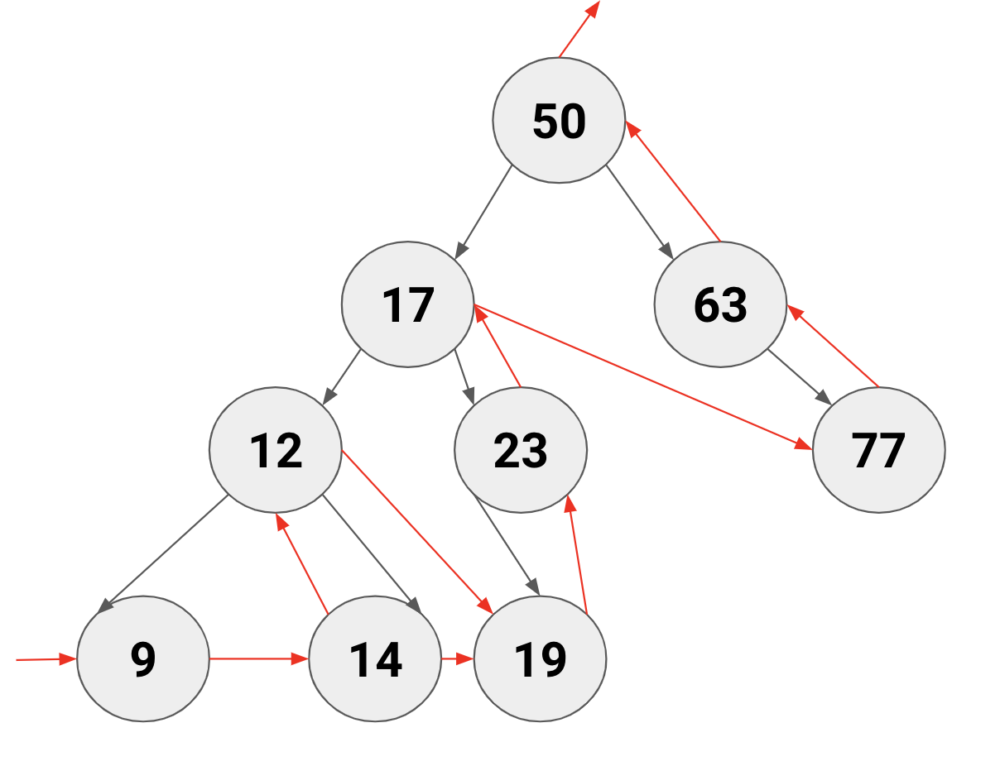
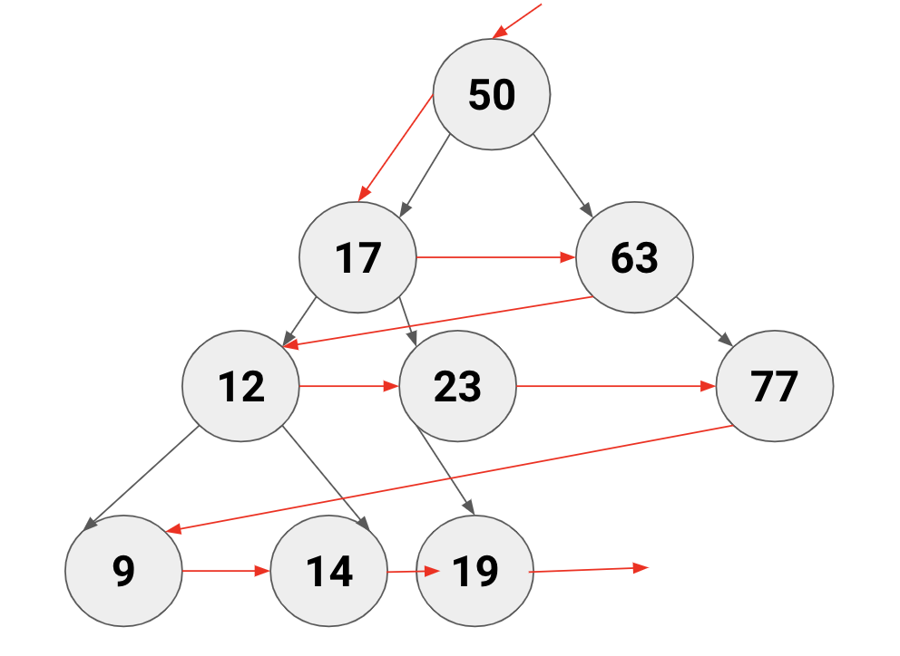

# What do we know about Trees?

A Tree is a non-linear data structure where data objects are organized in terms of hierarchical relationship.
The structure is non-linear in the sense that, unlike simple array and linked list implementation, data in a tree is not organized linearly. Each data element is stored in a structure called a node.

Think about an organization chart of family tree.

## BinarySearchTree (BST)
A Node in a Tree can have multiple branches. In a BST the BST Node can only have 2 branches. One on the left,
and one on the right. They are ordered. The left branch have values that are <= (lower or equal) than the parent node.

The right branch has values that are => than the parent node. Therefore each lookup, insertion or deletion takes time in proporsional to the logarithm (log) of the number of the
total items in the tree. (You can skip half of the tree).
O(log n) instead of O(n) when sorting an array. However it is
slower than the operations than a hashtable O(1).

## Depth First Search (DFS)

## Breadth First Search (BFS)

## Real world examples in Software Engineering?
DOM (Document Object Model)

## Info Graphic

## Traversal

  <h1>Binary Tree (BST)</h1>

  
Creation of a BST.

  

  
Tree Heights. Min height = 1; Max height = 3. 
    Root node is level 0. This tree is not balanced. (see node 63)

  
  
  

    In order traversal. Start from left leaf node,
    end with right leaf node.
    All numbers will be in order.
  

  
  
  

    Pre order. Start with root nodes, before the leafs.
    Follow each branch.
  

  
  
  

    Post order. Start with all the leaf nodes first.
    From leaf to leaf, then the parents, then the
    next branch. End with root node.
  

  

  
Level order. Start from the root node, and continue
    traversing for each level. End with the far right leaf node.
  

  
